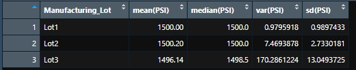
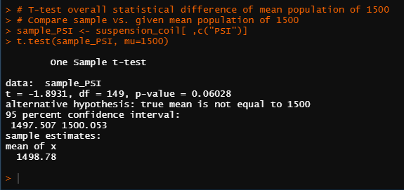
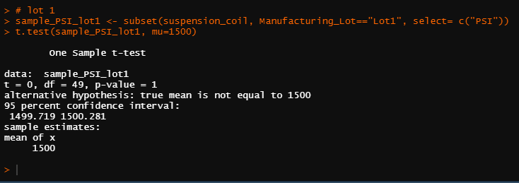
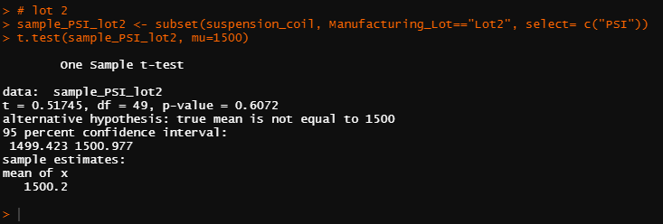

# MechaCar_Statistical_Analysis

## Overview of Project  
**Purpose:**  
The purpose of this project is to create a webpage that will scrape current news article, facts, and images of Mars with a click of a button.  

## Resources:  
- Data Source: [MechaCar_mpg.csv](https://github.com/tonywang3571/MechaCar_Statistical_Analysis/blob/master/MechaCar_mpg.csv), [Suspension_Coil.csv](https://github.com/tonywang3571/MechaCar_Statistical_Analysis/blob/master/Suspension_Coil.csv)  
- Software: R version 4.1.2, RStudio  

## Linear Regression to Predict MPG  
We preformed a [multiple linear regression model](https://github.com/tonywang3571/MechaCar_Statistical_Analysis/blob/master/Resources/linear_regression_summary.PNG) using RStudio. We calculated r-squared = 0.71 indicating a strong correlation between MPG and listed variables. The slope is not zero and dependent variables contribute to changes in mpg. We reject the null hypothesis (slope is zero and dependent variables do not effect changes in mpg) due to our low p-value = 5.35e-11. The PRr(>|t|) values of vehicle length (PRr(>|t|)=2.60e-12) and ground clearance (PRr(>|t|)=5.21e-8) are unlikely to provide random amounts of variance to our linear model. The intercept (PRr(>|t|)=5.08e-8) also explains a significant amount of variablitliy in mpg when all other independent variables are zero. Due to the lack of significant variables in our data, we would take caution to not overfit our regression model. Overfitting can decrease our ability to predict and generalize future datasets and regression models, but would show good performance in our current dataset.  

## Summary Statistics on Suspension Coils  
Suspension coils were tested to determine if the manufacturing process is consistent across different lots. We calculated summary statistics for both the total and by lot numbers of the suspension coils.  
Summary statistics for all of the suspension coils (includes all 3 lots):  
  
Summary statistics for each lot individually:  
  
The design specifications for the suspension coils must not exceed 100 PSI variance. We can see from our images that the total summary or combined summary (var=62.3 PSI) does meet the requirement of less than 100 PSI variance, but if we look at the lots separately, we can see that lot 3 (var=170 PSI) does not meet the requirement of less than 100 PSI variance.  

## T-Tests on Suspension Coils  
### T-Test Comparing All Manufacturing Lots vs. Mean PSI population = 1500:  
- H0: There is no statistical difference between the observed sample mean and its presumed population mean.
- HA: There is statistical difference between the observed sample mean and its presumed population mean.  

We calculated a p-value = 0.06, therefore we do not reject the null hypothesis and conclude that there is no statistical difference between the obsvered sample mean and its presumed population mean. If the p-value is less than or equal to 0.05, then can reject the null hypothesis because we are within 95% of our significance level.  
  

### T-Test Comparing Each Manufacturing Lot vs. Mean PSI population = 1500:  
- H0: There is no statistical difference between the observed sample mean of Lot 1 and its presumed population mean.
- HA: There is statistical difference between the observed sample mean of Lot 1 and its presumed population mean.  
  
Lot 1 p-value = 1. Therefore we do not reject the null hypothesis and conclude that there is no statistical difference between the observed sample mean of Lot 1 and its presumed population.  
  

- H0: There is no statistical difference between the observed sample mean of Lot 2 and its presumed population mean.
- HA: There is statistical difference between the observed sample mean of Lot 2 and its presumed population mean.  
  
Lot 2 p-value = 0.6. Therefore we do not reject the null hypothesis and conclude that there is no statistical difference between the observed sample mean of Lot 2 and its presumed population.  
  

- H0: There is no statistical difference between the observed sample mean of Lot 3 and its presumed population mean.
- HA: There is statistical difference between the observed sample mean of Lot 3 and its presumed population mean.  
  
Lot 3 p-value = 0.04. Therefore we reject the null hypothesis and conclude that there is statistical difference between the observed sample mean of Lot 3 and its presumed population.  
  

### Study Design: MechaCar vs Copetition

## Summary Analysis  

**Summary**  
The purpose of this project  

### Codes Used  
Please look at specific files for codes used  
Code for   
Code for   
Code for   
